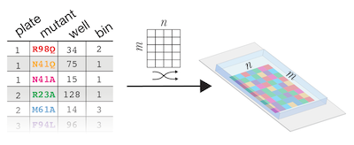

# Array Print
Interactive python notebook used in generating print inputs for a Scienion liquid-handling robot.

<code>Array Print</code> takes a <code>.csv</code> containing a MITOMI-assayable library in a 384-well layout and returns a Scienion-compatible <code>.fld</code> file and a <code>.csv</code> record of the array layout. Array Print optimizes the number of biological replicates that appear in the experiment and their placement within the print array to control for cross-chamber contamination during MITOMI experiments. If prior information about the reactivity of library members exists, the user may bin members by acitivity level and Array Print will prioritize placing less reactive members upstream on the array to minimize contamination along the flowpath.
